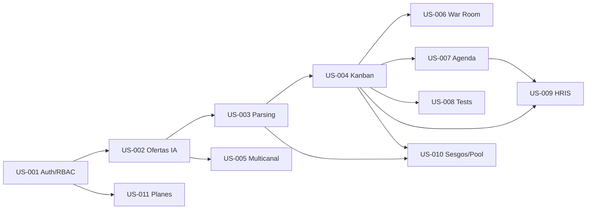

# User Stories iniciales — LTI (ATS con IA contextual)

**Producto:** LTI — Sistema de Reclutamiento Inteligente  
**Fuente PRD:** `LTI_NAR.md` v2.1  
**Fecha:** 17 de mayo de 2026  
**Autor:** Equipo producto (derivado de PRD)

---

## SECCIÓN 1 — User Stories

### US-001 — Autenticación, RBAC y alta de empresa

| Campo | Contenido |
|-------|-----------|
| **ID** | US-001 |
| **Prioridad inicial** | Must |
| **Épica** | Fundamentos y compliance |
| **Rol** | Como administrador de empresa (Owner) |
| **Necesidad** | Quiero registrar mi organización, invitar usuarios y asignar roles |
| **Beneficio** | Para operar LTI de forma segura y cumplir GDPR/RBAC desde el primer día |
| **Descripción** | Sprint 0 habilita el esqueleto multi-tenant: registro de EMPRESA, usuarios RECRUITER con jerarquía Owner > Admin > Manager > Recruiter > Viewer, JWT y MFA obligatorio para Admin+. Sin esto no hay aislamiento de datos ni trazabilidad de auditoría. |
| **Precondiciones** | Infraestructura base desplegada (API Fastify, PostgreSQL 15, Redis). Dominio de email verificado para invitaciones. |
| **Postcondiciones** | Empresa creada con SUBSCRIPTION en plan trial; al menos un Owner autenticado; roles asignables; audit trail inicial activo. |
| **Criterios de aceptación** | Ver tabla GWT siguiente |
| **Reglas de negocio** | RB-01: Un EMPRESA solo puede tener un Owner activo. RB-02: Viewer no puede crear ni editar VACANTE. RB-03: MFA obligatorio para Admin y Owner. RB-04: Tokens JWT expiran en 24h (refresh 7 días). RB-05: Toda acción privilegiada genera entrada en audit trail (retención 7 años). |
| **Datos afectados** | `EMPRESA`, `RECRUITER`, `SUBSCRIPTION`, `PLAN` |
| **Integraciones** | Email transaccional (invitaciones); **supuesto:** proveedor SMTP/SendGrid no detallado en PRD |
| **UX / Notas de interfaz** | Wizard onboarding 3 pasos: datos empresa → invitar equipo → elegir plan trial. Feedback de error en login (credenciales, MFA, cuenta bloqueada). |
| **No funcionales** | Encriptación credenciales; rate limit login; GDPR: consentimiento en registro |
| **Dependencias** | Infra Sprint 0 (US implícita de plataforma) |
| **Fuera de alcance** | SSO Enterprise, SCIM, SAML (Enterprise Q1 2027) |
| **Definición de Done (DoD)** | [ ] API auth documentada OpenAPI [ ] Tests integración RBAC por rol [ ] Migraciones aplicadas [ ] MFA probado en staging [ ] Runbook seguridad |
| **Checklist INVEST** | Ver tabla INVEST al final de la US |
| **Story Points (Fibonacci)** | 8 — múltiples roles, MFA y multi-tenant aumentan complejidad |
| **Trazabilidad PRD** | Bloque 4 (RBAC, MFA); Bloque 3 C4 Auth; Gantt Sprint 0 |

**Criterios de aceptación (Given / When / Then)**

1. **Happy path registro:** Given un visitante sin cuenta, When completa registro de empresa con email válido, Then se crea EMPRESA, RECRUITER Owner y SUBSCRIPTION trial.
2. **Happy path login:** Given un Recruiter activo con credenciales válidas, When inicia sesión, Then recibe JWT y accede al dashboard según su rol.
3. **MFA Admin:** Given un usuario Admin sin MFA configurado, When intenta acceder a funciones de administración, Then el sistema fuerza configuración MFA antes de continuar.
4. **Borde — email duplicado:** Given un email ya registrado en otra EMPRESA, When intenta registrarse de nuevo, Then recibe error 409 sin revelar si el email existe (anti-enumeración).
5. **Error — rol insuficiente:** Given un Viewer autenticado, When intenta POST /vacantes, Then recibe 403 y se registra en audit trail.
6. **Borde — invitación expirada:** Given un enlace de invitación >72h, When el invitado accede, Then puede solicitar reenvío al Owner.

**Checklist INVEST — US-001**

| Criterio | Sí/No | Justificación |
|----------|-------|---------------|
| Independiente | Parcial | Depende de infra; no de otras US funcionales |
| Negociable | Sí | Alcance MFA y trial negociable con PO |
| Valiosa | Sí | Habilita todo el producto y compliance |
| Estimable | Sí | Patrones estándar JWT/RBAC |
| Pequeña | No | Podría dividirse en US auth + US invitaciones |
| Testeable | Sí | Matriz de permisos automatizable |

---

### US-002 — Creación de ofertas con asistencia IA

| Campo | Contenido |
|-------|-----------|
| **ID** | US-002 |
| **Prioridad inicial** | Must |
| **Épica** | Gestión de vacantes |
| **Rol** | Como reclutador |
| **Necesidad** | Quiero generar y refinar descripciones de vacante con IA (SEO e inclusivo) |
| **Beneficio** | Para reducir ~80% el tiempo de redacción y alcanzar >85% adopción IA en ofertas (KPI Adopción de IA) |
| **Descripción** | El reclutador introduce requisitos mínimos; JobService invoca OpenAI para proponer título, descripción, requisitos y tono inclusivo. La VACANTE queda en Borrador o pasa a aprobación del Manager según workflow de la empresa. |
| **Precondiciones** | US-001; reclutador con permiso creación; límites de plan no excedidos (**supuesto:** validación en US-011). |
| **Postcondiciones** | VACANTE persistida con `requisitos_minimos` y `cultura` en JSONB; historial de versión IA opcional en `feedback_ia`. |
| **Criterios de aceptación** | Ver GWT |
| **Reglas de negocio** | RB-01: Solo Recruiter+ puede crear vacantes. RB-02: Manager debe aprobar si la empresa tiene workflow de aprobación activo. RB-03: Contenido IA debe pasar filtro de lenguaje inclusivo básico. RB-04: Máximo 3 vacantes activas en plan Starter. |
| **Datos afectados** | `VACANTE` (`requisitos_minimos`, `cultura`, estado), `RECRUITER` |
| **Integraciones** | OpenAI GPT-4-turbo (fallback GPT-3.5 según PRD) |
| **UX / Notas de interfaz** | Editor con preview lado a lado (borrador humano vs sugerencia IA); botones Regenerar, Aceptar sección, Enviar a aprobación. |
| **No funcionales** | Latencia generación <15s p95; no almacenar prompts con PII innecesaria |
| **Dependencias** | US-001 |
| **Fuera de alcance** | Publicación multicanal (US-005); fine-tuning Enterprise |
| **Definición de Done (DoD)** | [ ] Endpoint POST /vacantes/generate-ia [ ] Tests unitarios JobService [ ] Métrica producto: flag `created_with_ai` [ ] Copy legal consentimiento uso IA |
| **Checklist INVEST** | Sí en Valiosa/Estimable/Testeable; Pequeña: límite si incluye aprobación Manager |
| **Story Points (Fibonacci)** | 5 |
| **Trazabilidad PRD** | Bloque 1 §3 Creación de Ofertas; Bloque 2 UC1; KPI Adopción IA |

**Criterios de aceptación**

1. Given reclutador autenticado, When introduce skills y años experiencia y pulsa Generar con IA, Then recibe propuesta de descripción en <15s y puede guardar como Borrador.
2. Given vacante en Borrador, When Manager aprueba, Then estado pasa a Aprobada y queda lista para publicación.
3. Given OpenAI no disponible, When solicita generación, Then muestra mensaje y permite edición manual (modo degradado).
4. Given plan Starter con 3 vacantes activas, When intenta activar una cuarta, Then bloqueo 402 con CTA upgrade.
5. Given texto con términos sesgados detectados, When genera con IA, Then sistema sugiere alternativas inclusivas.
6. Given reclutador edita manualmente tras IA, When guarda, Then versión final no sobrescribe sin confirmación.

---

### US-003 — Recepción y parsing de CVs con scoring de match

| Campo | Contenido |
|-------|-----------|
| **ID** | US-003 |
| **Prioridad inicial** | Must |
| **Épica** | Captación y matching |
| **Rol** | Como candidato |
| **Necesidad** | Quiero enviar mi CV y recibir confirmación de que mi perfil se ha procesado |
| **Beneficio** | Para que LTI automatice screening (KPI Automatización 60% Q3) y reduzca time-to-hire (target 27 días) |
| **Descripción** | Flujo async: API encola aplicación → Worker Python parsea vía OpenAI → MatchingEngine calcula `score_match` (semantic 40%, experience 30%, culture 20%, potential 10%) → persistencia PostgreSQL + CV en S3 AES-256-GCM. Notificación al candidato y al reclutador. |
| **Precondiciones** | VACANTE publicada o con portal de aplicación activo; cola Bull/Redis operativa; bucket S3 configurado. |
| **Postcondiciones** | CANDIDATO y CANDIDATO_VACANTE creados/actualizados; `score_match` y `feedback_ia` JSONB; CV en S3; estado pipeline Aplicado → Screening_IA según umbrales 0.3/0.7 (**supuesto:** configurables por empresa en US-004). |
| **Criterios de aceptación** | Ver GWT |
| **Reglas de negocio** | RB-01: CV máx 10 MB, formatos PDF/DOCX. RB-02: Duplicado mismo email+vacante en 30 días → idempotencia, no doble scoring. RB-03: score_match = suma ponderada según Apéndice B PRD. RB-04: Anonimización CV tras 7 días post-parsing (GDPR). RB-05: Fallos IA tras retries → DLQ y modo manual. |
| **Datos afectados** | `CANDIDATO`, `CANDIDATO_VACANTE` (`score_match`, `feedback_ia`), S3 object key |
| **Integraciones** | OpenAI, S3, Bull/Redis, email |
| **UX / Notas de interfaz** | Formulario aplicación: drag-drop CV, barra progreso "Procesando perfil"; email transaccional al completar. |
| **No funcionales** | p95 parsing <90s; retry exponencial 1-2-4-8s; circuit breaker; auditoría decisión IA |
| **Dependencias** | US-001, US-002 (vacante existente), infra cola/S3 |
| **Fuera de alcance** | Parsing batch masivo importación ferias; video entrevistas |
| **Definición de Done (DoD)** | [ ] Flujo e2e staging [ ] Tests PDF corrupto, timeout, duplicado, rate limit [ ] Métricas parsing_success_rate [ ] DLQ runbook |
| **Checklist INVEST** | Valiosa y Testeable altos; Independiente parcial (necesita vacante) |
| **Story Points (Fibonacci)** | 13 — núcleo MVP, async, IA y resiliencia |
| **Trazabilidad PRD** | Bloque 2 UC3; Diagrama secuencia parsing; Apéndice B Matching; Gantt Sprint 1 |

**Criterios de aceptación**

1. Given candidato con PDF válido y vacante abierta, When envía aplicación, Then API responde 202 con `application_id` y encola job.
2. Given job procesado correctamente, When worker termina, Then `CANDIDATO_VACANTE.score_match` entre 0-1 y candidato recibe email confirmación.
3. Given score >0.7, When reclutador abre pipeline, Then candidato aparece en columna Screening_IA/Revisado según workflow.
4. Given PDF corrupto, When worker intenta parsear, Then job a DLQ y candidato recibe email de solicitud reenvío.
5. Given timeout OpenAI tras 4 retries, When circuit breaker abierto, Then modo degradado: perfil parcial + flag `manual_review_required`.
6. Given mismo email aplicó hace 10 días a misma vacante, When reenvía CV, Then actualiza registro sin duplicar CANDIDATO_VACANTE.
7. Given rate limit OpenAI, When worker recibe 429, Then backoff y reintento sin perder mensaje.

---

### US-004 — Screening con IA y pipeline Kanban

| Campo | Contenido |
|-------|-----------|
| **ID** | US-004 |
| **Prioridad inicial** | Must |
| **Épica** | Pipeline de selección |
| **Rol** | Como reclutador |
| **Necesidad** | Quiero visualizar candidatos en un tablero Kanban y actuar sobre recomendaciones de IA |
| **Beneficio** | Para priorizar revisión humana en top matches y aumentar precisión matching (target 80% satisfacción top-5) |
| **Descripción** | WorkflowStateMachine sincroniza estados del diagrama PRD (Aplicado → Screening_IA → Revisado_HR → …). Columnas Kanban drag-and-drop; tarjetas muestran score, explicación IA (`explainScore`) y umbrales configurables 0.3-0.7 por empresa. |
| **Precondiciones** | US-003 con al menos una aplicación procesada; reclutador autenticado. |
| **Postcondiciones** | Transición de estado persistida; feedback de reclutador alimenta aprendizaje (**supuesto MVP:** solo logging, fine-tuning Pro+). |
| **Criterios de aceptación** | Ver GWT |
| **Reglas de negocio** | RB-01: Auto-rechazo IA solo si score < umbral bajo y empresa habilita auto-rechazo. RB-02: Movimiento manual siempre permitido a Recruiter+. RB-03: Audit trail en cada cambio de estado. |
| **Datos afectados** | `CANDIDATO_VACANTE` (estado, `feedback_ia`), Workflow |
| **Integraciones** | WebSocket para actualizaciones en tiempo real del tablero |
| **UX / Notas de interfaz** | Tablero por VACANTE; filtros por score; panel lateral explicación IA; badges Rechazado_IA / Revisado_HR |
| **No funcionales** | Actualización WS <2s; RBAC por vacante |
| **Dependencias** | US-003 |
| **Fuera de alcance** | War Room (US-006); reglas custom Enterprise |
| **Definición de Done (DoD)** | [ ] Kanban e2e Cypress [ ] WebSocket load test básico [ ] Documentación umbrales |
| **Story Points (Fibonacci)** | 8 |
| **Trazabilidad PRD** | Diagrama estados candidato; Gantt Sprint 2; Bloque 1 pipeline visual |

**Criterios de aceptación**

1. Given aplicaciones con scores calculados, When reclutador abre Kanban de la vacante, Then ve columnas alineadas al workflow y tarjetas ordenadas por score desc.
2. Given candidato score 0.75 y umbral alto 0.7, When procesamiento IA finaliza, Then tarjeta sugiere mover a Revisado_HR (notificación).
3. Given reclutador arrastra tarjeta a Entrevista_Tecnica, When suelta, Then estado persiste y audit trail registra usuario y timestamp.
4. Given score 0.25 y auto-rechazo activo, When screening automático corre, Then pasa a Rechazado_IA con motivo en `feedback_ia`.
5. Given Viewer, When intenta mover tarjeta, Then acción bloqueada 403.
6. Given reclutador marca "No relevante" en sugerencia IA, When guarda feedback, Then evento registrado para métricas de precisión.

---

### US-005 — Publicación multicanal de vacantes

| Campo | Contenido |
|-------|-----------|
| **ID** | US-005 |
| **Prioridad inicial** | Should |
| **Épica** | Distribución y adquisición |
| **Rol** | Como reclutador |
| **Necesidad** | Quiero publicar una vacante aprobada en LinkedIn, Indeed y otros canales con un clic |
| **Beneficio** | Para ampliar funnel de candidatos sin duplicar trabajo manual |
| **Descripción** | Tras aprobación, JobService crea JOB_PUBLICATION por PUBLICATION_CHANNEL configurado. Sincronización con APIs externas; métricas de visualización donde el canal lo permita. |
| **Precondiciones** | US-002 vacante Aprobada; canales conectados (OAuth LinkedIn **supuesto**); límites API respetados. |
| **Postcondiciones** | Registros JOB_PUBLICATION con estado publicado/error; URLs externas almacenadas. |
| **Reglas de negocio** | RB-01: LinkedIn rate 100/day por PRD. RB-02: Fallo en un canal no revierte otros. RB-03: Despublicar sincroniza cierre en canales. |
| **Datos afectados** | `VACANTE`, `PUBLICATION_CHANNEL`, `JOB_PUBLICATION` |
| **Integraciones** | LinkedIn API POST /jobs; Indeed (**supuesto:** API similar Jul 2026) |
| **UX / Notas de interfaz** | Modal selección canales; indicadores éxito/error por canal; reintentar publicación |
| **No funcionales** | Idempotencia publicación; fallback email si API caída (PRD) |
| **Dependencias** | US-002 |
| **Fuera de alcance** | Campañas redes sociales orgánicas; paid job boards |
| **Definición de Done (DoD)** | [ ] Integración LinkedIn sandbox [ ] Tests mock Indeed [ ] Dashboard estado publicaciones |
| **Story Points (Fibonacci)** | 8 |
| **Trazabilidad PRD** | Bloque 2 UC2; Apéndice C LinkedIn; Gantt Sprint 3 |

**Criterios de aceptación**

1. Given vacante aprobada y LinkedIn conectado, When publica en multicanal, Then JOB_PUBLICATION creado por canal con estado `published`.
2. Given LinkedIn devuelve 429, When publica, Then canal marcado `pending_retry` y email al reclutador.
3. Given vacante ya publicada en LinkedIn, When intenta republicar sin cambios, Then idempotente sin duplicado externo.
4. Given Manager despublica vacante, When confirma, Then APIs externas reciben cierre (**supuesto:** endpoint cierre disponible).
5. Given canal Indeed no configurado, When selecciona solo LinkedIn, Then Indeed omitido sin error global.
6. Given error credenciales OAuth, When publica, Then 401 con guía reconexión en UI.

---

### US-006 — Colaboración en tiempo real (War Room)

| Campo | Contenido |
|-------|-----------|
| **ID** | US-006 |
| **Prioridad inicial** | Should |
| **Épica** | Colaboración |
| **Rol** | Como hiring manager |
| **Necesidad** | Quiero evaluar candidatos simultáneamente con el reclutador con comentarios en vivo |
| **Beneficio** | Para reducir ciclos de feedback y mejorar Quality of Hire mediante decisión conjunta |
| **Descripción** | Sala War Room por CANDIDATO_VACANTE: presencia, comentarios, votos y resumen IA compartido vía WebSocket. Plan Pro según PRD. |
| **Precondiciones** | US-004; plan Pro o superior (**supuesto:** feature flag por PLAN). |
| **Postcondiciones** | Comentarios persistidos; decisión consensuada registrada en audit trail. |
| **Reglas de negocio** | RB-01: Máx 10 participantes por sala. RB-02: Solo Manager+ puede marcar decisión final. |
| **Datos afectados** | `CANDIDATO_VACANTE`, comentarios (**supuesto:** tabla `WAR_ROOM_COMMENT` o JSONB en feedback) |
| **Integraciones** | WebSocket API |
| **UX / Notas de interfaz** | Avatares presentes, hilo comentarios, panel score IA, botón Solicitar segunda opinión |
| **No funcionales** | Latencia comentarios <500ms en LAN; conflict-free **supuesto:** last-write-wins con timestamp |
| **Dependencias** | US-004 |
| **Fuera de alcance** | Videollamada integrada |
| **Story Points (Fibonacci)** | 8 |
| **Trazabilidad PRD** | Bloque 1 ventaja competitiva War Room; Gantt Sprint 4; Plan Pro |

**Criterios de aceptación**

1. Given dos usuarios en War Room del mismo candidato, When uno comenta, Then el otro ve el comentario en <1s.
2. Given plan Starter, When intenta abrir War Room, Then upsell modal plan Pro.
3. Given Manager vota "Avanzar", When reclutador ya votó "Rechazar", Then UI muestra conflicto y solicita resolución.
4. Given usuario desconectado, When reconecta, Then recupera historial de comentarios de la sesión.
5. Given 11º usuario intenta unirse, When entra a la sala, Then error 403 sala llena.
6. Given decisión final Manager, When confirma, Then Kanban actualiza estado según voto.

---

### US-007 — Agenda inteligente y gestión de entrevistas

| Campo | Contenido |
|-------|-----------|
| **ID** | US-007 |
| **Prioridad inicial** | Should |
| **Épica** | Entrevistas |
| **Rol** | Como reclutador |
| **Necesidad** | Quiero programar entrevistas sincronizando calendarios sin coordinación manual |
| **Beneficio** | Para reducir time-to-hire eliminando ida y vuelta de emails |
| **Descripción** | InterviewService propone slots según disponibilidad Google Calendar de entrevistadores; candidato elige slot; crea ENTREVISTA y evento calendario bidireccional. |
| **Precondiciones** | Candidato en estado Entrevista_Tecnica o superior; calendarios OAuth conectados. |
| **Postcondiciones** | ENTREVISTA con fecha, tipo, participantes; evento en Google Calendar. |
| **Reglas de negocio** | RB-01: Mínimo 24h antelación para entrevista presencial (**supuesto**). RB-02: Reprogramación máx 2 veces por candidato. |
| **Datos afectados** | `ENTREVISTA`, `CANDIDATO_VACANTE`, `RECRUITER` |
| **Integraciones** | Google Calendar sync bidireccional |
| **UX / Notas de interfaz** | Widget slots; confirmación candidato por email; recordatorios 24h y 1h |
| **No funcionales** | Retry sync calendario; timezone por EMPRESA |
| **Dependencias** | US-004 |
| **Fuera de alcance** | Zoom/Teams nativo (**supuesto:** enlace manual en descripción evento) |
| **Story Points (Fibonacci)** | 8 |
| **Trazabilidad PRD** | Bloque 1 Agenda Inteligente; Apéndice C Google Calendar |

**Criterios de aceptación**

1. Given entrevistadores con Calendar conectado, When solicita disponibilidad 5 días, Then muestra slots libres comunes.
2. Given candidato elige slot, When confirma, Then ENTREVISTA creada y eventos en calendarios de todas las partes.
3. Given conflicto de calendario externo, When sync falla, Then retry y notificación al reclutador.
4. Given candidato cancela, When confirma cancelación, Then libera slot y notifica entrevistadores.
5. Given tercera reprogramación, When candidato intenta cambiar, Then bloqueo con contacto reclutador.
6. Given entrevistador sin OAuth, When programa entrevista, Then flujo manual con enlace iCal descargable.

---

### US-008 — Tests online integrados

| Campo | Contenido |
|-------|-----------|
| **ID** | US-008 |
| **Prioridad inicial** | Could |
| **Épica** | Evaluación |
| **Rol** | Como reclutador |
| **Necesidad** | Quiero enviar evaluaciones técnicas/psicométricas y ver resultados en el perfil del candidato |
| **Beneficio** | Para objetivar la fase post-screening y reducir falsos positivos del matching semántico |
| **Descripción** | Integración con proveedor de assessments (**supuesto:** marketplace add-on del PRD); invitación automática al pasar a etapa Tests; resultados en JSONB en CANDIDATO_VACANTE. |
| **Precondiciones** | US-004 estado compatible; add-on contratado. |
| **Postcondiciones** | Resultado almacenado; pipeline avanza si supera umbral configurable. |
| **Reglas de negocio** | RB-01: Tiempo límite test configurable. RB-02: No mostrar respuestas correctas a candidato en técnicos. |
| **Datos afectados** | `CANDIDATO_VACANTE` (`feedback_ia` o campo `assessment_results`) |
| **Integraciones** | API proveedor assessments (**supuesto:** HackerRank o similar) |
| **Dependencias** | US-004 |
| **Fuera de alcance** | Creación de banco de preguntas propio |
| **Story Points (Fibonacci)** | 5 |
| **Trazabilidad PRD** | Bloque 1 Tests Online; Revenue add-ons |

**Criterios de aceptación**

1. Given candidato en etapa Tests, When reclutador envía assessment, Then candidato recibe email con enlace único.
2. Given candidato completa test, When proveedor webhook notifica, Then resultados visibles en perfil <5 min.
3. Given score bajo umbral, When procesa resultado, Then sugiere Rechazado con motivo.
4. Given enlace expirado, When candidato accede, Then puede solicitar reenvío al reclutador.
5. Given webhook duplicado, When llega dos veces, Then procesamiento idempotente.
6. Given add-on no contratado, When intenta enviar test, Then error 402.

---

### US-009 — Onboarding y traspaso a HRIS

| Campo | Contenido |
|-------|-----------|
| **ID** | US-009 |
| **Prioridad inicial** | Should |
| **Épica** | Cierre de contratación |
| **Rol** | Como reclutador |
| **Necesidad** | Quiero generar la oferta laboral y transferir datos del candidato contratado al HRIS |
| **Beneficio** | Para cerrar el ciclo de reclutamiento sin re-digitación y mejorar time-to-hire |
| **Descripción** | Tras estado Contratado, NLG genera carta oferta; adaptador HRIS exporta paquete de datos (JSON **supuesto** estándar del partner). Consentimiento y minimización de datos. |
| **Precondiciones** | CANDIDATO_VACANTE en Oferta_Enviada → Contratado; integración HRIS configurada. |
| **Postcondiciones** | Oferta registrada; sync HRIS exitoso o cola reintento; audit trail transferencia. |
| **Reglas de negocio** | RB-01: Solo Admin+ configura mapeo HRIS. RB-02: Datos exportados según consentimiento candidato. |
| **Datos afectados** | `CANDIDATO`, `CANDIDATO_VACANTE`, `EMPRESA` |
| **Integraciones** | HRIS (genérico); NLG OpenAI para carta |
| **Dependencias** | US-004, US-007 |
| **Fuera de alcance** | Firma electrónica avanzada (**supuesto:** PDF descargable MVP) |
| **Story Points (Fibonacci)** | 8 |
| **Trazabilidad PRD** | Bloque 1 Onboarding; C4 HRIS |

**Criterios de aceptación**

1. Given candidato acepta oferta, When reclutador confirma contratación, Then genera documento oferta y estado Contratado.
2. Given HRIS conectado, When dispara sync, Then empleado creado en HRIS con campos mapeados.
3. Given HRIS caído, When sync falla, Then encola reintento y alerta Admin.
4. Given candidato revoca consentimiento datos, When intenta sync, Then bloqueo legal con log.
5. Given campos obligatorios HRIS faltantes, When valida export, Then lista campos pendientes en UI.
6. Given reclutador sin permiso, When intenta sync HRIS, Then 403.

---

### US-010 — Detección de sesgos y talent pool predictivo

| Campo | Contenido |
|-------|-----------|
| **ID** | US-010 |
| **Prioridad inicial** | Could |
| **Épica** | IA responsable y retención talento |
| **Rol** | Como manager |
| **Necesidad** | Quiero detectar patrones de sesgo en decisiones y redescubrir candidatos para nuevas vacantes |
| **Beneficio** | Para mejorar diversidad e inclusión y reducir pérdida de talento en pipeline (talent pool) |
| **Descripción** | Análisis periódico de decisiones vs cohortes protegidas (**supuesto:** métricas agregadas sin PII en dashboard); `talent_pool_score` en rechazados para recomendar en futuras VACANTE con notificación contextual. |
| **Precondiciones** | Histórico mínimo 50 decisiones por empresa (**supuesto** estadístico). |
| **Postcondiciones** | Informe sesgos; lista recomendaciones talent pool. |
| **Reglas de negocio** | RB-01: No usar atributos protegidos en scoring automático. RB-02: Candidato puede opt-out talent pool. |
| **Datos afectados** | `CANDIDATO_VACANTE.talent_pool_score`, agregados auditoría |
| **Integraciones** | OpenAI análisis; email notificaciones |
| **Dependencias** | US-003, US-004 |
| **Fuera de alcance** | Certificación auditoría externa sesgos |
| **Story Points (Fibonacci)** | 13 |
| **Trazabilidad PRD** | Bloque 1 §2 ítems 3 y 6; Lean Canvas sesgos |

**Criterios de aceptación**

1. Given suficiente histórico, When manager abre informe sesgos, Then ve alertas agregadas sin datos personales identificables.
2. Given candidato rechazado con talent_pool_score alto, When se publica vacante similar, Then reclutador ve sugerencia en pool.
3. Given candidato opt-out, When calcula pool, Then excluido de recomendaciones.
4. Given muestra insuficiente (<50), When abre informe, Then mensaje "datos insuficientes".
5. Given sesgo detectado en etapa Screening_IA, When revisa informe, Then enlace a audit trail de decisiones IA.
6. Given notificación talent pool al candidato, When envía, Then incluye enlace aplicación y base legal GDPR.

---

### US-011 — Gestión de planes y límites de uso (Starter/Pro/Enterprise)

| Campo | Contenido |
|-------|-----------|
| **ID** | US-011 |
| **Prioridad inicial** | Should |
| **Épica** | Monetización y operaciones |
| **Rol** | Como administrador (Owner) |
| **Necesidad** | Quiero ver el consumo de mi plan y límites (vacantes, aplicaciones) |
| **Beneficio** | Para evitar sobrecostos y preparar lanzamiento Starter (1 Sep 2026) con 50 clientes target |
| **Descripción** | SUBSCRIPTION vinculada a PLAN; métricas de uso en `metricas_uso`; enforcement en API (vacantes activas, aplicaciones/mes). Upgrade path a Pro/Enterprise. |
| **Precondiciones** | US-001; catálogo PLAN cargado (Starter/Pro/Enterprise fechas PRD). |
| **Postcondiciones** | Contadores actualizados; bloqueos o warnings al alcanzar límites. |
| **Reglas de negocio** | RB-01: Starter 3 vacantes, 200 aplicaciones/mes. RB-02: Pro aplicaciones ilimitadas, API 1000/h. RB-03: Enterprise sin límites estándar. |
| **Datos afectados** | `SUBSCRIPTION`, `PLAN`, `metricas_uso` |
| **Integraciones** | **Supuesto:** Stripe/billing externo post-MVP |
| **UX / Notas de interfaz** | Página Uso y facturación; barras progreso; CTA upgrade |
| **Dependencias** | US-001 |
| **Fuera de alcance** | Facturación automática completa en MVP (**supuesto:** manual o beta) |
| **Story Points (Fibonacci)** | 5 |
| **Trazabilidad PRD** | Bloque 1 §7 Pricing; entidad SUBSCRIPTION |

**Criterios de aceptación**

1. Given plan Starter, When tiene 200 aplicaciones en el mes, Then nuevas aplicaciones rechazadas con 402.
2. Given Owner, When consulta dashboard uso, Then ve vacantes activas y aplicaciones vs límites.
3. Given upgrade a Pro, When pago confirmado (**supuesto** webhook), Then límites actualizados en <1 min.
4. Given API Pro, When supera 1000 req/h, Then 429 rate limit.
5. Given Enterprise, When consulta límites, Then no aplica tope vacantes estándar.
6. Given aplicación 199/200, When llega la 200, Then warning email al Owner al 90% ya enviado (**supuesto**).

---

## SECCIÓN 2 — Product Backlog priorizado

### 2.1 Metodología de priorización

Se aplica **WSJF simplificado**:

\[
\text{WSJF} = \frac{\text{Valor de negocio (1-5)} + \text{Urgencia temporal (1-5)} + \text{Reducción de riesgo (1-5)}}{\text{Costo de desarrollo (1-5)}}
\]

El resultado se normaliza a escala **1-10** para la tabla. **Valor de negocio** pondera impacto en KPIs (time-to-hire, automatización, ingresos). **Urgencia temporal** alinea hitos del Gantt (Alpha 30 Jun, APIs Jul, Beta 15 Ago, Starter 1 Sep). **Reducción de riesgo** favorece parsing, auth y compliance. **Costo** usa Story Points relativos del equipo. Mayor WSJF = mayor prioridad.

### 2.2 Tabla de backlog ordenada

| Rank | ID | Título | MoSCoW | WSJF (1-10) | Sprint objetivo | Dependencias | Riesgo |
|------|-----|--------|--------|-------------|-----------------|--------------|--------|
| 1 | US-001 | Auth, RBAC y empresa | Must | 9.2 | Sprint 0 (15-31 May) | Infra | Medio |
| 2 | US-003 | Parsing CV + scoring | Must | 9.0 | Sprint 1 (22 May-12 Jun) | US-001, US-002 mín. | Alto |
| 3 | US-002 | Ofertas con IA | Must | 8.5 | Sprint 1 | US-001 | Medio |
| 4 | US-004 | Kanban + screening IA | Must | 8.3 | Sprint 2 (12-26 Jun) | US-003 | Medio |
| 5 | US-011 | Planes y límites Starter | Should | 7.8 | Sprint 2-3 | US-001 | Bajo |
| 6 | US-005 | Publicación multicanal | Should | 7.5 | Sprint 3 (1-22 Jul) | US-002 | Alto |
| 7 | US-007 | Agenda inteligente | Should | 6.8 | Sprint 3-4 | US-004 | Medio |
| 8 | US-006 | War Room | Should | 6.5 | Sprint 4 (5-26 Ago) | US-004, Pro flag | Medio |
| 9 | US-009 | Onboarding + HRIS | Should | 6.2 | Sprint 4-5 | US-004, US-007 | Alto |
| 10 | US-008 | Tests online | Could | 5.0 | Post-Starter | US-004 | Medio |
| 11 | US-010 | Sesgos + talent pool | Could | 4.5 | Sprint 5+ | US-003, US-004 | Alto |

### 2.3 Mapa de dependencias

### 2.4 Releases sugeridos

| Release | Fecha | Contenido |
|---------|-------|-----------|
| **Release 0 (Sprint 0)** | 31 May 2026 | Infra AWS, PostgreSQL, Redis, Bull, S3, CI/CD, US-001 auth/RBAC/MFA, esqueleto React+Fastify |
| **Alpha** | 30 Jun 2026 | US-002, US-003, US-004 — parsing, matching, Kanban; métricas alpha: time-to-hire 38d, automatización 40% |
| **Beta** | 15 Ago 2026 | + US-005, US-006, US-007, US-011 parcial; 5 startups piloto; métricas beta: 35d, 50% auto |
| **Starter** | 1 Sep 2026 | US-011 completo, hardening, US-008 opcional deshabilitado; lanzamiento $299/mes, 10→50 clientes |
| **Pro** | 31 Oct 2026 | War Room estable, API 1000/h, scoring predictivo avanzado |

---

## SECCIÓN 3 — User Story elegida para descomposición

**US elegida: US-003 — Recepción y parsing de CVs con scoring de match.**

**Justificación (3-5 líneas):** Es el corazón del MVP de junio 2026 y el caso de uso más detallado en el PRD (diagrama de secuencia, manejo de errores, C4 `ReceiveApplicationService`). Impacta directamente los KPIs de **automatización (60%)** y **time-to-hire (-40%)** al eliminar entrada manual de datos. Concentra el mayor **riesgo técnico** (OpenAI, colas async, S3, resiliencia) y desbloquea US-004 Kanban. Su complejidad justifica descomposición en tickets de 1-3 días sin ambigüedad en contratos API.

---

## SECCIÓN 4 — Tickets de trabajo (US-003)

### TK-301 — Migraciones PostgreSQL candidatos y aplicaciones

| Campo | Contenido |
|-------|-----------|
| **Tipo** | Backend |
| **US padre** | US-003 |
| **Descripción** | Crear esquema para CANDIDATO, CANDIDATO_VACANTE con JSONB y índices para búsqueda por vacante y email. |
| **Componentes** | `CandidateRepository`, capa infra PostgreSQL |
| **Tareas** | [ ] Migration `candidatos` [ ] Migration `candidato_vacante` con `score_match`, `feedback_ia` [ ] Índices únicos email+vacante [ ] Seed datos test [ ] Rollback script |
| **Contratos API** | N/A (capa datos) |
| **Modelo de datos** | Tablas según ER PRD; campos `talent_pool_score` nullable |
| **Cola/eventos** | N/A |
| **Seguridad** | Cifrado columnas PII sensibles **supuesto:** pgcrypto o app-level |
| **Pruebas** | Migración up/down en CI |
| **Observabilidad** | Log duración migración |
| **Criterios de aceptación** | 1) Given BD vacía, When migrate up, Then tablas existen. 2) Given duplicado email+vacante_id, When insert, Then violación unique. 3) Given rollback, When migrate down, Then sin pérdida otros módulos. |
| **Dependencias** | — |
| **Bloqueantes** | Acceso PostgreSQL staging |
| **Estimación** | 3 SP — 8-12 h |
| **Asignación sugerida** | Backend Sr |

---

### TK-302 — Configuración S3 y política de encriptación CVs

| Campo | Contenido |
|-------|-----------|
| **Tipo** | Infra |
| **US padre** | US-003 |
| **Descripción** | Bucket S3 con SSE-KMS/AES-256-GCM, políticas IAM least-privilege, lifecycle según retención GDPR. |
| **Componentes** | Adaptador almacenamiento salida hexagonal |
| **Tareas** | [ ] Terraform/CDK bucket [ ] IAM roles API y Worker [ ] Prefijos por `empresa_id` [ ] Lifecycle 24 meses [ ] Test upload/download |
| **Contratos API** | N/A |
| **Modelo de datos** | Campo `cv_s3_key` en CANDIDATO |
| **Cola/eventos** | N/A |
| **Seguridad** | AES-256-GCM; sin URLs públicas; presigned 15 min |
| **Pruebas** | Integración upload archivo test |
| **Observabilidad** | Métrica s3_upload_errors |
| **Criterios de aceptación** | 1) Given PDF, When upload, Then objeto cifrado en bucket. 2) Given URL expirada, When download, Then 403. 3) Given rol no autorizado, When upload, Then denegado. |
| **Dependencias** | TK-301 |
| **Estimación** | 3 SP — 10-14 h |
| **Asignación sugerida** | DevOps |

---

### TK-303 — Cola Bull/Redis y contrato de jobs parsing

| Campo | Contenido |
|-------|-----------|
| **Tipo** | Infra / Backend |
| **US padre** | US-003 |
| **Descripción** | Definir cola `parsing.resume` con payload tipado, reintentos, DLQ `parsing.resume.dlq`. |
| **Componentes** | Message Queue adaptador, `ParsingJobProducer` |
| **Tareas** | [ ] Config Bull [ ] Schema payload JSON [ ] Retry policy 1-2-4-8s [ ] DLQ consumer stub [ ] Idempotency key `application_id` |
| **Contratos API** | Payload: `{ "application_id": "uuid", "vacante_id": "uuid", "s3_key": "string", "idempotency_key": "string" }` |
| **Modelo de datos** | Tabla opcional `parsing_jobs` estado **supuesto** |
| **Cola/eventos** | `parsing.resume`, `parsing.resume.dlq` |
| **Seguridad** | Redis AUTH; no PII en logs de cola |
| **Pruebas** | Unit producer; integración encolar/consumir mock |
| **Observabilidad** | Métricas queue_depth, job_duration |
| **Criterios de aceptación** | 1) Given job válido, When encola, Then aparece en waiting. 2) Given fallo 5 veces, When agota retries, Then DLQ. 3) Given mismo idempotency_key, When encola dos veces, Then un solo job activo. |
| **Dependencias** | TK-302 |
| **Estimación** | 5 SP — 12-16 h |
| **Asignación sugerida** | Backend Sr |

---

### TK-304 — API POST /applications (recepción síncrona)

| Campo | Contenido |
|-------|-----------|
| **Tipo** | Backend |
| **US padre** | US-003 |
| **Descripción** | Endpoint público/autenticado para candidato: sube CV, valida, guarda S3, encola parsing, responde 202. |
| **Componentes** | `ReceiveApplicationService`, REST Controller, Auth rate limit |
| **Tareas** | [ ] DTO validación [ ] Upload multipart a S3 [ ] Crear CANDIDATO_VACANTE estado Aplicado [ ] Encolar job [ ] Respuesta 202 |
| **Contratos API** | `POST /api/v1/vacantes/{vacanteId}/applications` multipart: `file`, `email`, `nombre`. Response 202: `{ "application_id": "uuid", "status": "queued" }`. Errores: 400 formato, 413 tamaño, 409 duplicado, 429 rate limit, 402 límite plan |
| **Modelo de datos** | Insert CANDIDATO, CANDIDATO_VACANTE |
| **Cola/eventos** | Publica en `parsing.resume` |
| **Seguridad** | Rate limit por IP; validación MIME; scan antivirus **supuesto** ClamAV async |
| **Pruebas** | Integración API; contrato OpenAPI |
| **Observabilidad** | Trace `application_id` en logs |
| **Criterios de aceptación** | 1) Given PDF válido, When POST, Then 202 y job encolado. 2) Given file >10MB, When POST, Then 413. 3) Given vacante cerrada, When POST, Then 404. |
| **Dependencias** | TK-301, TK-302, TK-303 |
| **Estimación** | 5 SP — 16-20 h |
| **Asignación sugerida** | Backend Sr |

---

### TK-305 — Puerto ResumeParsingPort e AIAdapter (OpenAI)

| Campo | Contenido |
|-------|-----------|
| **Tipo** | Worker / Backend |
| **US padre** | US-003 |
| **Descripción** | Implementar interfaz hexagonal y adaptador OpenAI para extraer JSON estructurado del CV. |
| **Componentes** | `ResumeParsingPort`, `AIAdapter`, `callOpenAI` |
| **Tareas** | [ ] Interface dominio [ ] Prompt engineering extracción [ ] Parser respuesta JSON [ ] Fallback GPT-3.5 [ ] Timeout 60s |
| **Contratos API** | Interno: `parse(file_bytes) -> ParsedResumeDTO` |
| **Modelo de datos** | Campos mapeados a CANDIDATO JSONB skills, experience |
| **Cola/eventos** | Consumido por worker |
| **Seguridad** | No enviar datos innecesarios; región EU **supuesto** si disponible |
| **Pruebas** | Unit con mocks; golden files 3 CVs |
| **Observabilidad** | Métrica openai_latency, token_usage |
| **Criterios de aceptación** | 1) Given CV estándar, When parse, Then JSON con skills y años exp. 2) Given 503 OpenAI, When parse, Then excepción retriable. 3) Given JSON malformado modelo, When parse, Then error no retriable. |
| **Dependencias** | TK-303 |
| **Estimación** | 8 SP — 20-28 h |
| **Asignación sugerida** | ML Engineer |

---

### TK-306 — MatchingEngine y persistencia score_match

| Campo | Contenido |
|-------|-----------|
| **Tipo** | Worker |
| **US padre** | US-003 |
| **Descripción** | Implementar `calculate_score` con pesos PRD y `explainScore`; actualizar CANDIDATO_VACANTE. |
| **Componentes** | `MatchingEngine`, `CandidateRepository.updateScore` |
| **Tareas** | [ ] semantic 0.4 [ ] experience 0.3 [ ] culture 0.2 [ ] potential 0.1 [ ] `feedback_ia` explicación [ ] Tests unitarios pesos |
| **Contratos API** | Interno |
| **Modelo de datos** | Update `score_match`, `feedback_ia` |
| **Cola/eventos** | Tras parsing exitoso en mismo job |
| **Seguridad** | Audit trail entrada/salida scoring |
| **Pruebas** | Unit casos límite 0 y 1; regresión pesos |
| **Observabilidad** | Histograma score_distribution |
| **Criterios de aceptación** | 1) Given perfil y vacante conocidos, When calculate, Then score esperado ±0.05. 2) Given explainScore, When consulta, Then 4 dimensiones en JSON. 3) Given feedback reclutador, When learnFromFeedback, Then log evento **MVP sin retrain**. |
| **Dependencias** | TK-305, TK-301 |
| **Estimación** | 5 SP — 14-18 h |
| **Asignación sugerida** | ML Engineer + Backend |

---

### TK-307 — Worker Python procesamiento end-to-end

| Campo | Contenido |
|-------|-----------|
| **Tipo** | Worker |
| **US padre** | US-003 |
| **Descripción** | Consumer Bull desde Python: descarga S3, parse, score, persist, notifica API. |
| **Componentes** | Worker container C4, orquestación job |
| **Tareas** | [ ] Consumer Redis/Bull **supuesto:** bridge HTTP o redis direct [ ] Pipeline S3→AI→DB [ ] Manejo estados job [ ] Healthcheck [ ] Dockerfile |
| **Contratos API** | Callback interno `PATCH /internal/applications/{id}` **supuesto** |
| **Modelo de datos** | Updates transaccionales |
| **Cola/eventos** | Consume `parsing.resume` |
| **Seguridad** | Credenciales IAM rol worker |
| **Pruebas** | Integración con LocalStack/minio |
| **Observabilidad** | job_success, job_failure counters |
| **Criterios de aceptación** | 1) Given job en cola, When worker procesa, Then score persistido <90s p95. 2) Given S3 inaccesible, When procesa, Then retry. 3) Given éxito, When termina, Then marca job completed. |
| **Dependencias** | TK-305, TK-306, TK-303 |
| **Estimación** | 8 SP — 24-32 h |
| **Asignación sugerida** | Backend + ML |

---

### TK-308 — Circuit breaker, retry exponencial y DLQ operativo

| Campo | Contenido |
|-------|-----------|
| **Tipo** | Backend / Worker |
| **US padre** | US-003 |
| **Descripción** | Implementar patrón del diagrama PRD: breaker OpenAI, retries, modo degradado, admin notification. |
| **Componentes** | Resilience layer en `AIAdapter` |
| **Tareas** | [ ] Circuit breaker config [ ] Cache último parse exitoso **supuesto** Redis [ ] Modo degradado flag [ ] Admin alert email [ ] Dashboard DLQ **supuesto** básico |
| **Contratos API** | `GET /admin/dlq/parsing` lista jobs **supuesto** |
| **Modelo de datos** | Flag `manual_review_required` |
| **Cola/eventos** | DLQ consumer manual replay |
| **Seguridad** | Admin RBAC only |
| **Pruebas** | Chaos test OpenAI down |
| **Observabilidad** | Alert breaker_open |
| **Criterios de aceptación** | 1) Given 5 fallos OpenAI, When breaker, Then no llamadas 30s. 2) Given breaker abierto, When aplica, Then modo degradado. 3) Given job en DLQ, When admin replay, Then reencola. |
| **Dependencias** | TK-305, TK-307 |
| **Estimación** | 5 SP — 12-18 h |
| **Asignación sugerida** | Backend Sr |

---

### TK-309 — Detección duplicados e idempotencia aplicación

| Campo | Contenido |
|-------|-----------|
| **Tipo** | Backend |
| **US padre** | US-003 |
| **Descripción** | Evitar doble CANDIDATO_VACANTE por email+vacante en ventana 30 días; actualizar CV si re-aplica. |
| **Componentes** | `ReceiveApplicationService.validate` |
| **Tareas** | [ ] Query duplicados [ ] Merge policy CV [ ] Header Idempotency-Key [ ] Tests concurrencia |
| **Contratos API** | 409 vs 200 update según política acordada **supuesto:** 200 update |
| **Modelo de datos** | Unique constraint |
| **Cola/eventos** | Re-encolar solo si CV nuevo |
| **Seguridad** | — |
| **Pruebas** | Test paralelo 2 POST simultáneos |
| **Observabilidad** | duplicate_application_count |
| **Criterios de aceptación** | 1) Given re-aplica en 10 días, When POST, Then actualiza mismo registro. 2) Given dos POST paralelos, When procesan, Then un registro. 3) Given Idempotency-Key repetido, When POST, Then misma respuesta 202. |
| **Dependencias** | TK-304 |
| **Estimación** | 3 SP — 8-12 h |
| **Asignación sugerida** | Backend Jr |

---

### TK-310 — Notificaciones email candidato y reclutador

| Campo | Contenido |
|-------|-----------|
| **Tipo** | Backend |
| **US padre** | US-003 |
| **Descripción** | Notification Port: confirmación recepción y parsing completado con resumen score. |
| **Componentes** | `NotificationPort`, Email adapter |
| **Tareas** | [ ] Templates ES [ ] Evento parsing.completed [ ] Enlace estado aplicación [ ] Unsubscribe GDPR |
| **Contratos API** | Evento interno; sin API pública |
| **Modelo de datos** | — |
| **Cola/eventos** | `notifications.email` opcional |
| **Seguridad** | No incluir score en email si empresa deshabilita **supuesto** |
| **Pruebas** | Mock SMTP; snapshot templates |
| **Observabilidad** | email_send_failures |
| **Criterios de aceptación** | 1) Given aplicación recibida, When encolada, Then email confirmación <1 min. 2) Given parsing OK, When completa, Then email candidato. 3) Given parsing fallido, Then email solicitud nuevo CV. |
| **Dependencias** | TK-307 |
| **Estimación** | 3 SP — 8-12 h |
| **Asignación sugerida** | Backend Jr |

---

### TK-311 — Frontend formulario de aplicación y estado

| Campo | Contenido |
|-------|-----------|
| **Tipo** | Frontend |
| **US padre** | US-003 |
| **Descripción** | Página pública aplicación: upload, validación cliente, polling estado, mensajes error. |
| **Componentes** | React + Tailwind, API client |
| **Tareas** | [ ] UI drag-drop [ ] Validación tamaño/tipo [ ] Polling GET status [ ] Estados queued/processing/completed/failed [ ] i18n ES |
| **Contratos API** | `GET /api/v1/applications/{id}/status` → `{ "status": "...", "score_match": null|float }` |
| **Modelo de datos** | — |
| **Cola/eventos** | — |
| **Seguridad** | CORS portal carreras |
| **Pruebas** | Cypress happy path |
| **Observabilidad** | Frontend RUM **supuesto** |
| **Criterios de aceptación** | 1) Given PDF, When envía, Then muestra progreso. 2) Given 413 backend, When error, Then mensaje claro. 3) Given completed, When poll, Then muestra confirmación sin score si política. |
| **Dependencias** | TK-304 |
| **Estimación** | 5 SP — 14-18 h |
| **Asignación sugerida** | Frontend |

---

### TK-312 — Rate limiting OpenAI y aplicaciones públicas

| Campo | Contenido |
|-------|-----------|
| **Tipo** | Backend |
| **US padre** | US-003 |
| **Descripción** | Rate limit Redis en API aplicaciones y throttling llamadas OpenAI por empresa. |
| **Componentes** | Rate Limit middleware, AI gateway |
| **Tareas** | [ ] Límite IP aplicaciones [ ] Cuota tokens/empresa/día [ ] Respuesta 429 con Retry-After [ ] Tests rate limit |
| **Contratos API** | Headers `Retry-After` en 429 |
| **Modelo de datos** | Contador Redis |
| **Cola/eventos** | Delay jobs si cuota excedida |
| **Seguridad** | Anti-abuse |
| **Pruebas** | Test 429 OpenAI simulado |
| **Observabilidad** | rate_limit_hits |
| **Criterios de aceptación** | 1) Given 100 req/min IP, When excede, Then 429. 2) Given cuota OpenAI empresa, When excede, Then jobs delayed. 3) Given 429 OpenAI, When worker, Then backoff. |
| **Dependencias** | TK-304, TK-305 |
| **Estimación** | 3 SP — 8-12 h |
| **Asignación sugerida** | Backend Sr |

---

### TK-313 — Auditoría decisiones IA y anonimización CV

| Campo | Contenido |
|-------|-----------|
| **Tipo** | Backend |
| **US padre** | US-003 |
| **Descripción** | Registrar audit trail parsing/scoring; job anonimizar S3 tras 7 días. |
| **Componentes** | Audit service, scheduled job |
| **Tareas** | [ ] Tabla audit_ia_decisions [ ] Log input hash CV [ ] Cron anonimización [ ] Export candidato GDPR endpoint link |
| **Contratos API** | `GET /export/candidate/{id}` referenciado PRD **supuesto** stub |
| **Modelo de datos** | audit + purge S3 |
| **Cola/eventos** | `gdpr.anonymize` scheduled |
| **Seguridad** | Retención 7 años audit; 7 días CV raw |
| **Pruebas** | Test cron elimina objeto S3 |
| **Observabilidad** | anonymization_job_runs |
| **Criterios de aceptación** | 1) Given parsing, When score, Then audit con modelo y versión. 2) Given 7 días, When cron, Then CV anonimizado. 3) Given solicitud export, When candidato, Then JSON sin datos terceros. |
| **Dependencias** | TK-306, TK-302 |
| **Estimación** | 5 SP — 12-16 h |
| **Asignación sugerida** | Backend Sr |

---

### TK-314 — Suite pruebas e2e y casos borde parsing

| Campo | Contenido |
|-------|-----------|
| **Tipo** | QA |
| **US padre** | US-003 |
| **Descripción** | Automatizar casos PRD: PDF corrupto, timeout IA, duplicado, rate limit. |
| **Componentes** | — |
| **Tareas** | [ ] Fixture PDF corrupto [ ] Mock timeout OpenAI [ ] Test duplicado [ ] Test 429 [ ] Informe cobertura >80% crítico |
| **Contratos API** | — |
| **Modelo de datos** | — |
| **Cola/eventos** | — |
| **Seguridad** | Datos sintéticos |
| **Pruebas** | e2e pipeline CI |
| **Observabilidad** | — |
| **Criterios de aceptación** | 1) Given PDF corrupto, When e2e, Then DLQ. 2) Given timeout mock, When e2e, Then degradado. 3) Given CI verde, When merge, Then gate pasa. |
| **Dependencias** | TK-304–TK-308 |
| **Estimación** | 5 SP — 16-20 h |
| **Asignación sugerida** | QA |

---

### TK-315 — Dashboard métricas parsing (observabilidad)

| Campo | Contenido |
|-------|-----------|
| **Tipo** | Infra |
| **US padre** | US-003 |
| **Descripción** | Grafana/Datadog: latencia parsing, tasa éxito, cola, breaker, tokens OpenAI. |
| **Componentes** | — |
| **Tareas** | [ ] Instrumentar métricas [ ] Dashboard [ ] Alertas p95>90s, DLQ>10 [ ] Runbook enlazado |
| **Contratos API** | — |
| **Modelo de datos** | — |
| **Cola/eventos** | — |
| **Seguridad** | — |
| **Pruebas** | Validar alertas en staging |
| **Observabilidad** | Core entregable |
| **Criterios de aceptación** | 1) Given deploy staging, When dashboard, Then paneles visibles. 2) Given p95>90s, When alerta, Then Slack **supuesto**. 3) Given DLQ>10, When 15 min, Then página on-call. |
| **Dependencias** | TK-307, TK-308 |
| **Estimación** | 3 SP — 8-12 h |
| **Asignación sugerida** | DevOps |

---

## SECCIÓN 5 — Estimación de esfuerzo (Extra)

### 5.1 Tabla resumen

| Ticket | SP | Horas (min-max) | Talla |
|--------|-----|-----------------|-------|
| TK-301 | 3 | 8-12 | S |
| TK-302 | 3 | 10-14 | S |
| TK-303 | 5 | 12-16 | M |
| TK-304 | 5 | 16-20 | M |
| TK-305 | 8 | 20-28 | L |
| TK-306 | 5 | 14-18 | M |
| TK-307 | 8 | 24-32 | L |
| TK-308 | 5 | 12-18 | M |
| TK-309 | 3 | 8-12 | S |
| TK-310 | 3 | 8-12 | S |
| TK-311 | 5 | 14-18 | M |
| TK-312 | 3 | 8-12 | S |
| TK-313 | 5 | 12-16 | M |
| TK-314 | 5 | 16-20 | M |
| TK-315 | 3 | 8-12 | S |
| **Total** | **69 SP** | **186-254 h** | — |

**Con buffer +15% (OpenAI/parsing):** ~79 SP efectivos | **214-292 h**

### 5.2 Planning Poker simulado (US-003 / tickets críticos)

| Ticket | Backend Sr | Backend Jr | Frontend | DevOps | QA | Consenso SP |
|--------|-------------|------------|----------|--------|-----|-------------|
| TK-305 | 8 | 13 | 5 | 5 | 8 | **8** |
| TK-307 | 13 | 8 | 3 | 5 | 8 | **8** |
| TK-304 | 5 | 5 | 3 | 3 | 5 | **5** |
| TK-308 | 5 | 8 | 2 | 3 | 5 | **5** |
| TK-314 | 5 | 5 | 3 | 3 | 8 | **5** |

Votos dispersos en TK-307 (complejidad bridge Python-Node) se convergió en 8 tras dividir spike de integración en Sprint Planning.

### 5.3 Velocity y sprint

- **Velocity asumida:** 25 SP / sprint de 2 semanas  
- **Total US-003:** 69 SP (+15% ≈ **79 SP efectivos**)  
- **Sprints necesarios:** 79 / 25 ≈ **3,2 → 4 sprints** (solo US-003, equipo completo paralelizado reduce a ~2,5 sprints si Backend/ML/FE/DevOps trabajan en paralelo por dependencias)  
- **Plan realista con paralelismo:** Sprint 1 (TK-301–304, 311 parcial) + Sprint 2 (TK-305–308, 311) ≈ **2 sprints** para MVP parsing alineado Gantt Sprint 1 (21 días).

### 5.4 Buffer de riesgo

Se aplica **+15%** sobre 69 SP = **10 SP** de contingencia integrados en estimación efectiva (79 SP), cubriendo: variabilidad prompts OpenAI, calidad PDFs reales, latencia cola bajo carga beta.

---

## SECCIÓN 6 — Riesgos, supuestos y preguntas abiertas

### 6.1 Supuestos (máx. 10)

1. Proveedor email transaccional disponible (SendGrid o similar) no especificado en PRD.
2. API Indeed sigue el mismo patrón que LinkedIn en Sprint 3.
3. Bridge Bull entre Node y Python vía Redis compartido o API interna.
4. Facturación Starter en beta es manual; Stripe post-1 Sep.
5. Tabla `WAR_ROOM_COMMENT` no está en ER; se usa JSONB en `feedback_ia` hasta migración.
6. Umbrales 0.3/0.7 por defecto; configuración por empresa en MVP solo Admin.
7. Scan antivirus CV opcional en MVP (ClamAV async).
8. Región EU para OpenAI cuando esté disponible; si no, DPA firmado.
9. HRIS usa export JSON genérico; conectores específicos post-Starter.
10. Assessments vía partner externo; no desarrollo propio de tests en MVP.

### 6.2 Preguntas al PO (máx. 8)

1. ¿Re-aplicación mismo email actualiza registro (200) o rechaza (409)?
2. ¿Mostrar `score_match` al candidato en portal o solo al reclutador?
3. ¿Auto-rechazo IA <0.3 activo por defecto en Starter o solo Pro?
4. ¿Proveedor HRIS prioritario para integración beta (nombre)?
5. ¿War Room exclusivo Pro desde 1 Sep o disponible limitado en Starter?
6. ¿Límite 200 aplicaciones/mes: ¿hard stop o soft con overage?
7. ¿Campos obligatorios en formulario aplicación además de CV (teléfono, LinkedIn)?
8. ¿Política retención CV 7 días anonimización aplicable desde alpha o solo GA?

### 6.3 Top 5 riesgos y mitigación

| # | Riesgo | Tipo | Mitigación |
|---|--------|------|------------|
| 1 | Indisponibilidad OpenAI en pico | Técnico | Circuit breaker, GPT-3.5 fallback, DLQ + manual (TK-308) |
| 2 | Variabilidad calidad parsing PDFs | Técnico | Golden tests, modo degradado, revisión manual |
| 3 | Incumplimiento GDPR retención CV | Legal | TK-313 anonimización; legal review consentimientos |
| 4 | Rate limits LinkedIn retrasan go-to-market Jul | Producto | Publicación manual fallback email; cola retry |
| 5 | Scope creep War Room/Pro antes Starter | Producto | Feature flags por PLAN; MoSCoW estricto en Sprint 4 |

### 6.4 Inconsistencias detectadas en PRD

- **Bloque 2** solo detalla 3 casos de uso; Kanban, War Room, Tests y HRIS existen en visión pero sin UC formal — operacionalizado con **supuestos** en US-004–US-010.
- **Diagrama estados:** nota "Screening_IA implementado Julio 2026" vs Gantt Sprint 1 parsing junio — alinear en planning (US-003 junio, umbrales auto julio).
- **Matching:** Apéndice B en Python; stack Worker Python coherente, API Node debe invocar o duplicar lógica — decisión: scoring en Worker (TK-306/307).
- **Fechas README ejercicio** vs PRD 2026: se sigue roadmap PRD v2.1.

---

*Fin del documento. Trazabilidad completa al PRD `LTI_NAR.md` v2.1.*
