Aquí tienes el documento completo con los diagramas C4 corregidos (usando sintaxis 100% compatible con GitHub/Mermaid) y el resto de diagramas funcionando correctamente.

---

# 🚀 LTI: Documento de Especificación Maestra (v2.1)
## *Sistema de Reclutamiento Inteligente con IA Contextual*

**Última actualización:** 10 de mayo de 2026  
**Próxima revisión:** 10 de agosto de 2026  
**Estado:** Activo - En implementación fases 1-2

---

## Bloque 0: Métricas de Éxito y KPIs

### Métricas Clave del Producto

```yaml
Métricas de Éxito:
  Time-to-hire:
    objetivo: Reducción del 40% vs baseline
    medición: Desde publicación hasta aceptación de oferta
    target_2026: 27 días (baseline 45 días)
    target_2027: 22 días
    
  Tasa de Automatización:
    objetivo: 70% de screenings sin intervención humana
    medición: Candidatos procesados automáticamente / total aplicaciones
    target_2026: 60% (fin Q3)
    target_2027: 75%
  
  Quality of Hire:
    objetivo: Retention a 6 meses > 85%
    medición: Porcentaje de contratados que superan período de prueba
    target_2026: 82%
    target_2027: 87%
  
  Adopción de IA:
    objetivo: >90% de ofertas creadas con asistencia IA
    medición: Ofertas generadas con IA / total ofertas
    target_2026: 85%
    target_2027: 95%
  
  Precisión de Matching:
    objetivo: 85% de satisfacción en primeras 5 recomendaciones
    medición: Feedback de reclutadores sobre relevancia
    target_2026: 80%
    target_2027: 88%
```

### Fechas Clave 2026-2027

```yaml
Hitos Temporales:
  Q2_2026 (Actual - Mayo 2026):
    - 10 mayo: Documento v2.1 publicado
    - 15 mayo: Inicio Sprint 0 (Setup infraestructura)
    - 25 mayo: Kick-off equipo completo
    - 31 mayo: Definición final de arquitectura
  
  Q2_2026 (Junio):
    - 15 junio: MVP parsing básico operativo
    - 30 junio: Primer release interno (alpha)
  
  Q3_2026:
    - 15 julio: Inicio beta cerrada (5 startups)
    - 15 agosto: Revisión de métricas post-beta
    - 1 septiembre: Lanzamiento comercial Starter
    - 30 septiembre: 50 clientes activos
  
  Q4_2026:
    - 31 octubre: Release Pro features
    - 30 noviembre: 200 clientes
    - 15 diciembre: Certificación SOC2 Type I
    - 31 diciembre: Revisión anual estratégica
  
  Q1_2027:
    - 31 enero: Release Enterprise
    - 28 febrero: Expansión internacional (LatAm)
    - 31 marzo: 500 clientes
```

---

## Bloque 1: Producto, Funcionalidades y Negocio

### 1. Visión del Producto

**LTI** es un ecosistema de reclutamiento inteligente diseñado para startups que necesitan escalar sin fricción. Nuestra visión es transformar el ATS tradicional de un simple repositorio de datos a un **Orquestador de Talento Agéntico**. Nos centramos en la **automatización inteligente**, la **colaboración en tiempo real** y la **asistencia contextual de IA** para acelerar decisiones críticas y amplificar las capacidades humanas.

### 2. Valor Añadido: Ventajas Competitivas

1. **IA Contextual y Adaptativa:** Matching semántico que entiende el contexto de los roles y aprende de las decisiones pasadas para mejorar sugerencias futuras.
2. **Colaboración en Tiempo Real:** Interfaz tipo "War Room" donde reclutadores y managers evalúan candidatos simultáneamente con feedback en vivo.
3. **Detección de Sesgos Inconscientes:** Análisis proactivo mediante IA para identificar y mitigar patrones de prejuicio en el proceso de selección.
4. **Automatización de "Toque Humano":** Generación de comunicaciones personalizadas y empáticas (rechazos, ofertas, invitaciones) mediante NLG (Generación de Lenguaje Natural).
5. **Insights Predictivos:** Dashboards que predicen el *time-to-hire* y el riesgo de no-aceptación de oferta basándose en datos históricos.
6. **Talent Pool Predictivo:** IA identifica candidatos rechazados que podrían encajar en futuras vacantes con auto-notificación contextual.

### 3. Funcionalidades Core

* **Creación de Ofertas:** Uso de IA para generar descripciones optimizadas para SEO y lenguaje inclusivo.
* **Publicación Multicanal:** Distribución automática en portales (LinkedIn, Indeed) y redes sociales con un clic.
* **Recepción y Parsing:** Extracción neuronal de datos de CVs para estructurar perfiles automáticamente.
* **Revisión con IA:** Screening automático y scoring predictivo basado en el ajuste semántico candidato-vacante.
* **Tests Online:** Integración de evaluaciones técnicas y psicométricas con resultados instantáneos.
* **Agenda Inteligente:** Scheduling automático que sincroniza calendarios de entrevistadores y candidatos sin intervención manual.
* **Onboarding:** Cierre del ciclo con generación de ofertas y traspaso automático de datos al HRIS.

### 4. Diagrama de Proceso de Reclutamiento

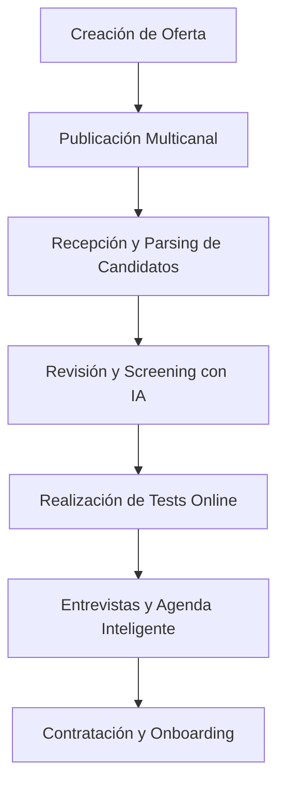

### 5. Diagrama de Estados de Candidato

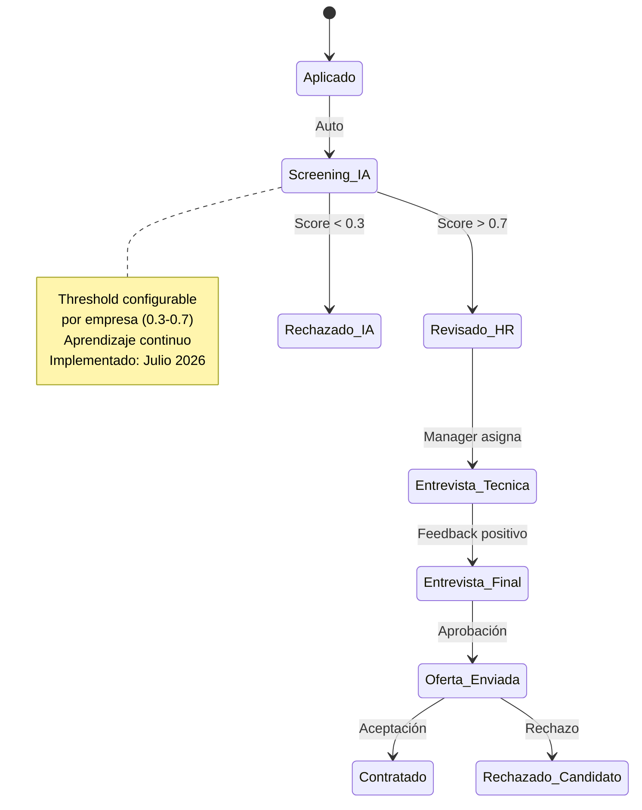

### 6. Lean Canvas

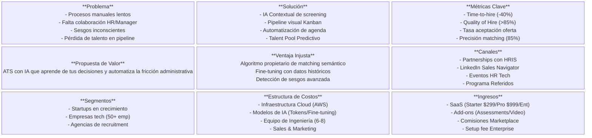

### 7. Modelo de Pricing

```yaml
Starter ($299/mes - Lanzamiento 1 Septiembre 2026):
  - 3 vacantes activas
  - 200 aplicaciones/mes
  - Parsing básico
  - Matching estándar
  - Email support (24h)
  - Ideal: Startups <10 empleados

Pro ($999/mes - Lanzamiento 31 Octubre 2026):
  - 15 vacantes activas
  - Aplicaciones ilimitadas
  - IA avanzada + scoring predictivo
  - Colaboración tiempo real
  - API access (rate: 1000/h)
  - Priority support (4h)
  - Ideal: Empresas 10-200 empleados

Enterprise (Custom - Lanzamiento 31 Enero 2027):
  - Vacantes ilimitadas
  - Custom AI fine-tuning
  - On-premise option
  - SLA 99.9%
  - CSM dedicado
  - Ideal: >200 empleados
```

---

## Bloque 2: Casos de Uso Detallados

### 1. Creación de Ofertas de Empleo

* **Descripción:** El Reclutador define los requisitos y la IA genera una vacante optimizada.
* **Actores:** Reclutador, Sistema LTI, Manager (Aprobador).
* **Precondiciones:** Reclutador autenticado y con permisos de creación.
* **Postcondiciones:** Vacante guardada en estado "Borrador" o enviada a aprobación.
* **Métrica asociada:** Reducción 80% tiempo redacción vs manual.
* **Estado:** Implementado en MVP (Junio 2026)

### 2. Publicación Automática en Portales

* **Descripción:** Distribución síncrona de la vacante aprobada a múltiples canales externos.
* **Actores:** Reclutador, APIs Externas (LinkedIn, Indeed).
* **Precondiciones:** Vacante aprobada y configurada con canales de publicación.
* **Postcondiciones:** Oferta visible en portales externos.
* **Estado:** Implementación Julio 2026

### 3. Recepción y Procesamiento de Solicitudes (Parsing)

* **Descripción:** Extracción automática de información estructurada de archivos adjuntos.
* **Actores:** Candidato, Sistema LTI.
* **Precondiciones:** Candidato envía aplicación vía portal.
* **Postcondiciones:** Perfil estructurado con score de match.
* **Estado:** MVP completado (Junio 2026)

### Diagrama de Secuencia (Recepción y Procesamiento)

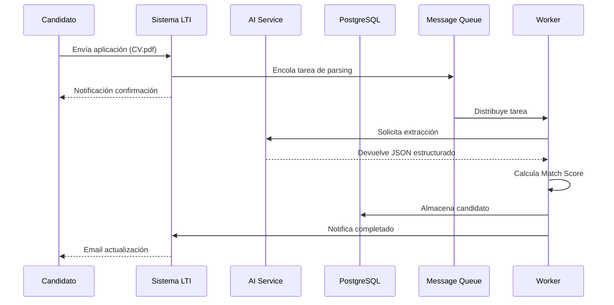

### Manejo de Errores en Parsing

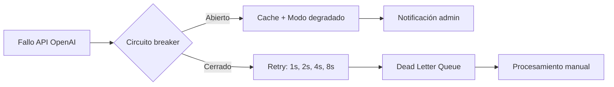

---

## Bloque 3: Modelo de Datos y Arquitectura de Sistema

### 1. Modelo de Datos (ER)

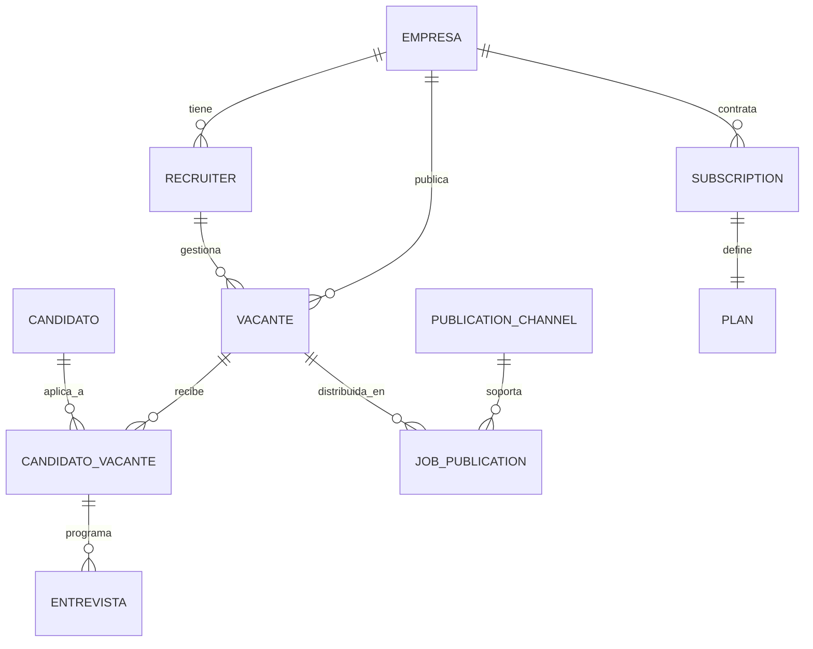

**Entidades Clave:**

* **CANDIDATO_VACANTE:** Almacena `score_match` (float), `feedback_ia` (JSONB), `talent_pool_score` (float)
* **VACANTE:** Define `requisitos_minimos` (JSONB), `cultura` (JSONB)
* **SUBSCRIPTION:** Registra `plan_type`, `fechas`, `metricas_uso`

### 2. Decisión de Arquitectura: Hexagonal Modular

Arquitectura **Hexagonal Modular** implementada como monolito bien delimitado inicialmente, permitiendo aislamiento de la lógica de negocio de cambios en APIs externas.

### 3. Diagrama de Arquitectura de Alto Nivel

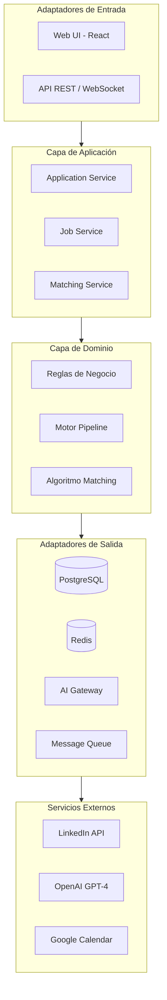

### 4. Diagrama C4 - Nivel 1: Contexto

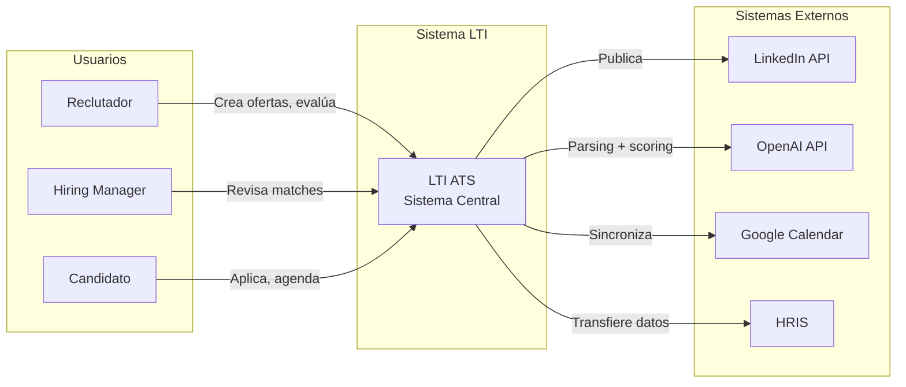

### 5. Diagrama C4 - Nivel 2: Contenedores

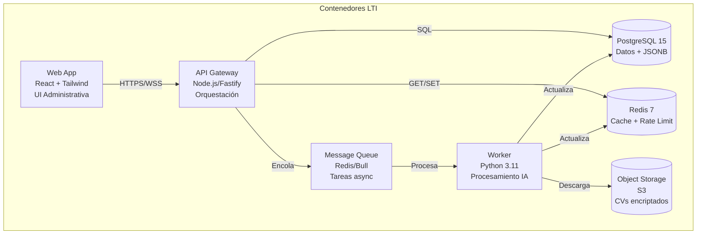

### 6. Diagrama C4 - Nivel 3: Componentes API

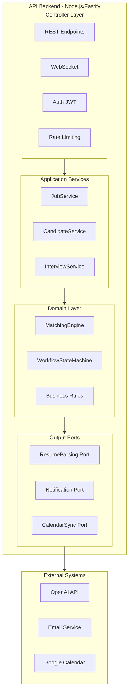

### 7. Diagrama C4 - Nivel 4: Clases Core

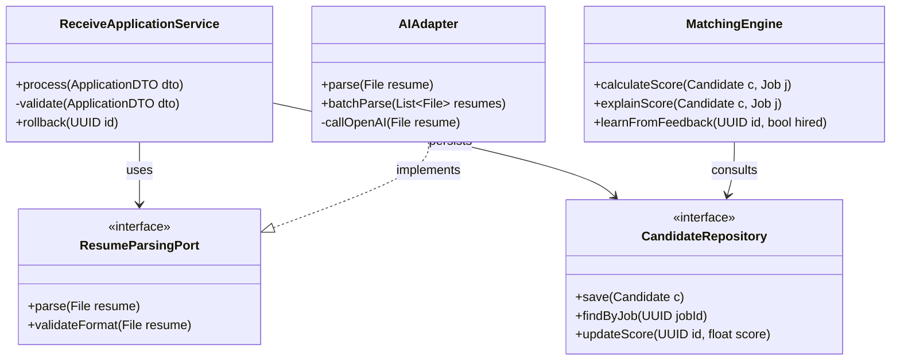

### 8. Hoja de Ruta de Implementación

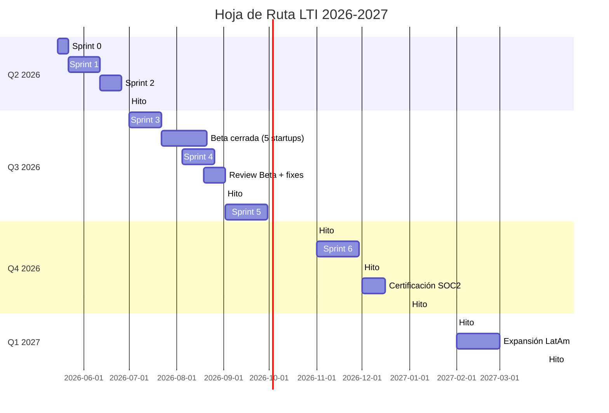

---

## Bloque 4: Seguridad y Compliance

### Estrategia de Seguridad

```yaml
GDPR / Ley de Datos:
  anonimización: CVs anonimizados post-parsing (7 días)
  retención: 24 meses default (configurable 12-36)
  exportabilidad: JSON + PDF firmado via /export/candidate/{id}
  consentimiento: Granular por canal, revocable

Seguridad Técnica:
  encriptación: AES-256-GCM para CVs en reposo
  auditoría: Audit trail de decisiones IA (7 años)
  acceso: RBAC: Owner > Admin > Manager > Recruiter > Viewer
  MFA: Obligatorio para Admin+
```

---

## Bloque 5: Responsabilidades y Equipo

### Estructura del Equipo (Mayo 2026)

```yaml
Core Team (8 personas):
  Producto:
    - Product Manager: David R.
    - UX/UI Designer: Valentina S. (consultora)
  
  Ingeniería:
    - Tech Lead: Karina M.
    - Backend: Pablo G., Lucia F.
    - Frontend: Mateo L.
  
  Datos/IA:
    - ML Engineer: Santiago P.
  
  Operaciones:
    - DevOps: Camila R.
    - QA Engineer: Sofia L.
```

### Calendario de Revisiones

| Reunión | Frecuencia | Horario |
|---------|------------|---------|
| Daily Standup | Diario | 10:00 AM |
| Sprint Planning | 2 semanas | Lunes 11:00 AM |
| Sprint Review | 2 semanas | Viernes 4:00 PM |
| Retrospective | 2 semanas | Viernes 5:00 PM |

**Revisiones Estratégicas:**
- 2026-06-30: Review Q2
- 2026-08-15: Post-beta review
- 2026-09-15: Steering Committee
- 2026-12-31: OKRs Q4 review
- 2027-03-31: OKRs Q1 review

---

## Apéndices

### A. Métricas de Éxito por Fase

| Fase | Fecha | Time-to-hire | Automatización | Clientes |
|------|-------|--------------|----------------|----------|
| Alpha | 30 Jun 2026 | 38 días | 40% | 0 |
| Beta | 15 Ago 2026 | 35 días | 50% | 5 |
| Launch | 1 Sep 2026 | 32 días | 55% | 10→50 |
| Release Pro | 31 Oct 2026 | 30 días | 60% | 50→200 |
| GA | 30 Nov 2026 | 28 días | 65% | 200→300 |
| Year End | 31 Dic 2026 | 27 días | 68% | 300→400 |
| Q1 2027 | 31 Mar 2027 | 25 días | 72% | 500 |

### B. Algoritmo de Matching

```python
class AdvancedMatchingEngine:
    def calculate_score(self, candidate, job):
        return {
            "semantic": 0.4 * self.bert_similarity(
                candidate.skills, job.requirements
            ),
            "experience": 0.3 * self.years_match(
                candidate.experience, job.min_years
            ),
            "culture": 0.2 * self.culture_fit(
                candidate.values, job.culture_traits
            ),
            "potential": 0.1 * self.learning_agility(
                candidate.certifications
            )
        }
```

### C. Integraciones con APIs Externas

| API | Endpoints clave | Rate Limit | Fallback |
|-----|----------------|------------|----------|
| LinkedIn | POST /jobs, GET /metrics | 100/day | Email |
| OpenAI | GPT-4-turbo | 10k/min | GPT-3.5 |
| Google Calendar | Sync bidireccional | 1M/day | Retry |

---

## 📋 Changelog

| Versión | Fecha | Cambios | Autor |
|---------|-------|---------|-------|
| v2.1 | 2026-05-10 | Diagramas C4 corregidos para compatibilidad GitHub. Fechas actualizadas a 2026-2027. | Equipo LTI |
| v2.0 | 2024-01-22 | Versión original con mejoras (obsoleta) | Equipo LTI |

---

**Documento generado:** Especificación Maestra LTI v2.1  
**Estado:** ✅ Activo - En implementación  
**Próxima revisión:** 10 de agosto de 2026
